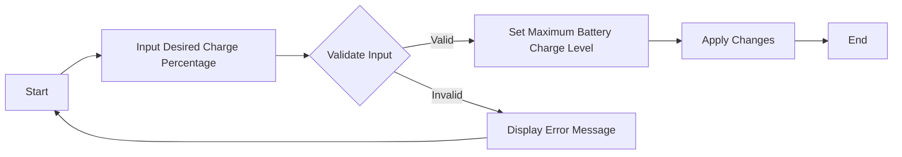

# Battery Charge Limiter

## Description

This script allows you to set the maximum battery charge level on your Windows machine. It provides a user-friendly way to input your desired battery charge percentage and applies the setting using either a .bat or .ps1 file.

## How it Works

The script utilizes Windows PowerShell commands to modify the battery charge settings. It prompts the user to input their desired charge percentage, validates the input to ensure it falls within the allowable range (50% to 100%), and then sets the maximum battery charge accordingly.

## How to Use

### Using .bat (Batch) File

1. Save the "bat_limiter.bat" file to your computer.
2. Right-click the file and choose "Run as administrator" to ensure it has the necessary privileges.
3. Follow the on-screen instructions to input your desired battery charge percentage.

### Using .ps1 (PowerShell) Script

1. Save the "bat_limiter.ps1" file to your computer.
2. Open PowerShell with administrative privileges (right-click on PowerShell and choose "Run as administrator").
3. Navigate to the directory where you saved the script using the `cd` command.
4. Execute the script by running `.\bat_limiter.ps1`.
5. Follow the on-screen instructions to input your desired battery charge percentage.

## Flowchart

## Note

- Ensure you run the script or .bat file with administrative privileges for it to modify the battery charge settings successfully.
- The valid charge percentage range is from 50% to 100%. Input outside this range will result in an error message.
- Please note that this script uses a specific GUID (`5dd8f6e0-7d83-4c3e-bfcb-00b0c98b9b09`) for the battery setting, which may vary depending on your system. Ensure that it works correctly on your machine. If you encounter issues, consult your system documentation or modify the script with the appropriate GUID for your system.

---

Feel free to adjust the file names and content to match your actual files and preferences. This README provides a clear explanation of the script's purpose, how to use it, and even includes a simple flowchart using Mermaid to visualize the process.
