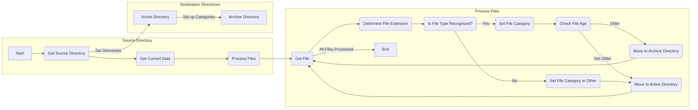

# File Organization Automation Script README

## Description
This script automates the process of organizing and managing files in specified directories. It categorizes files based on their types and moves older files to an archive folder, helping you maintain a well-organized file structure with minimal manual effort.

## Definition
File Organization Automation Script is available in two versions: a .bat script and a .ps1 script. Both scripts categorize files into different categories based on their file types and move files older than a specified threshold to an archive folder.

## Explanation (How It Works)

### .bat Script (Batch Version)
1. **File Categorization:** The .bat script identifies the file type of each file based on its extension and categorizes it accordingly (e.g., images, documents, videos).

2. **Age-Based Archiving:** Files are evaluated for their age. Files older than a defined threshold (default: 45 days) are moved to an archive folder within the respective category.

3. **Automatic Organization:** The script creates destination directories for each file category in both "active" and "archive" directories. It then moves files to the appropriate category based on their file type and age.

### .ps1 Script (PowerShell Version)
1. **File Categorization:** The .ps1 script identifies the file type of each file based on its extension and categorizes it accordingly (e.g., images, documents, videos).

2. **Age-Based Archiving:** Files are evaluated for their age. Files older than a defined threshold (default: 45 days) are moved to an archive folder within the respective category.

3. **Automatic Organization:** The script creates destination directories for each file category in both "active" and "archive" directories. It then moves files to the appropriate category based on their file type and age.

## How to Use

### .bat Script (Batch Version)
1. **Download the Script:** Download the `FileOrganization.bat` script to the directory you want to organize.

2. **Run the Script:** Double-click the `FileOrganization.bat` script or run it using the command prompt.

3. **File Organization:** The script will automatically categorize files in the source directory into appropriate categories based on their extensions and move older files to the archive directory as per the defined threshold.

### .ps1 Script (PowerShell Version)
1. **Download the Script:** Download the `FileOrganization.ps1` script to the directory you want to organize.

2. **Run the Script:** Open PowerShell, navigate to the directory containing the script, and run it using the following command:
   ```powershell
   .\FileOrganization.ps1
   ```

3. **File Organization:** The script will automatically categorize files in the source directory into appropriate categories based on their extensions and move older files to the archive directory as per the defined threshold.

4. **Customization (Optional):** You can customize the script by modifying source/destination directories, the file age threshold, or add more conditions for file types and actions as needed.

## Flowchart



## Note
- Make sure to customize the script's source and destination directories to match your specific requirements.
- The default file age threshold is set to 45 days. You can change it by modifying the `$daysThreshold` variable in the scripts.
- These scripts use the Assoc command (in the .ps1 script) to determine file types based on file extensions. Ensure that file extensions are correctly associated with their respective programs on your system for accurate categorization.

---

Enjoy automated file organization and keep your directories tidy!

For more information, refer to the script's comments and customization options within the script itself.
