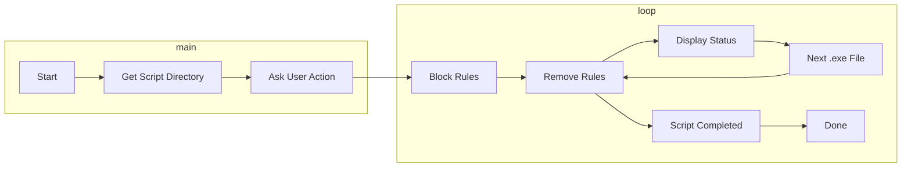

# Firewall Rule Management

## Overview

This set of scripts lets you manage Windows Firewall rules for specific .exe files. Choose to block or remove firewall rules for .exe files in the same directory as the script, enhancing system security.

## Prerequisites

- For Windows operating systems.
- Administrative privileges to manage Windows Firewall rules.
- Familiarity with running scripts on Windows.

## Choose a Script

Two options:

1. **Batch Script (.bat)**: Simple and user-friendly. Name: `fw_rule_manager.bat`.

2. **PowerShell Script (.ps1)**: Offers advanced functionality. Name: `fw_rule_manager.ps1`.

## How It Works

**Batch Script (.bat)**:

1. Detects the script's directory.
2. Asks to block or remove firewall rules.
3. Adds outbound and inbound rules to block or removes existing rules for each .exe file.

**PowerShell Script (.ps1)**:

1. Gets the script's directory.
2. Asks to block or remove firewall rules.
3. Adds outbound and inbound rules to block or removes existing rules for each .exe file.

## How to Use the Batch Script (.bat)

1. **Download** `fw_manager.bat`.

2. **Save** it in the directory with .exe files.

3. **Run** by double-clicking or command prompt.

4. **Choose Action**: 1 to block, 2 to remove.

5. **Script Execution**: Auto-detects and processes .exe files.

6. **Done**: Displays "Done" and pauses for review.

## How to Use the PowerShell Script (.ps1)

1. **Download** `fw_manager.ps1`.

2. **Save** it anywhere.

3. **Run** in PowerShell with admin privileges.

4. **Navigate** to script's directory (if needed).

5. **Execute** with `.\fw_manager.ps1`.

6. **Choose Action**: 1 to block, 2 to remove.

7. **Script Execution**: Auto-detects and processes .exe files.

8. **Done**: Displays "Done."

## Flowchart 

## Disclaimer

- Use these scripts responsibly with necessary permissions.
- Caution when modifying firewall rules; it affects network access for applications.

---

Select the script that suits your needs and follow the provided instructions to manage Windows Firewall rules for .exe files.
