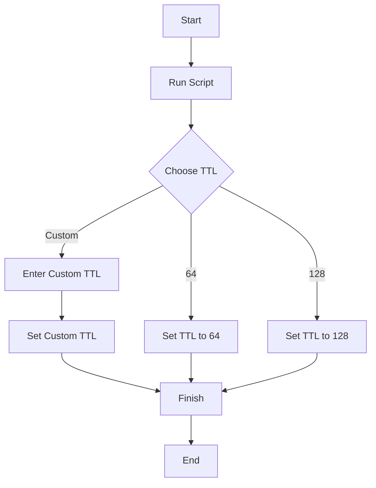

# TTL Setting Scripts README

These scripts allow you to set the TTL (Time to Live) value on your Windows machine. TTL is an important network parameter that affects how long data packets are valid before being discarded.

## How They Work

Both scripts follow a similar process:

1. Run the script with administrator privileges.
2. Choose from three TTL options: 64, 128, or Custom.
3. If you select "Custom," enter your desired TTL value.
4. The script will set the chosen TTL value in the Windows Registry.

## How to Use

### Using set_ttl.bat (Batch Script)

1. Save the script as `set_ttl.bat`.
2. Right-click on it and choose "Run as administrator."
3. Follow the on-screen instructions to set the TTL value.

### Using set_ttl.ps1 (PowerShell Script)

1. Save the script as `set_ttl.ps1`.
2. Open PowerShell as an administrator.
3. Navigate to the folder where the script is saved.
4. Run the script by typing `.\set_ttl.ps1`.
5. Follow the on-screen prompts to set the TTL value.

## Flowchart

Here's a visual representation of how these scripts work:

These scripts provide an easy way to configure TTL settings on your Windows machine, enhancing your control over network packet lifetimes.